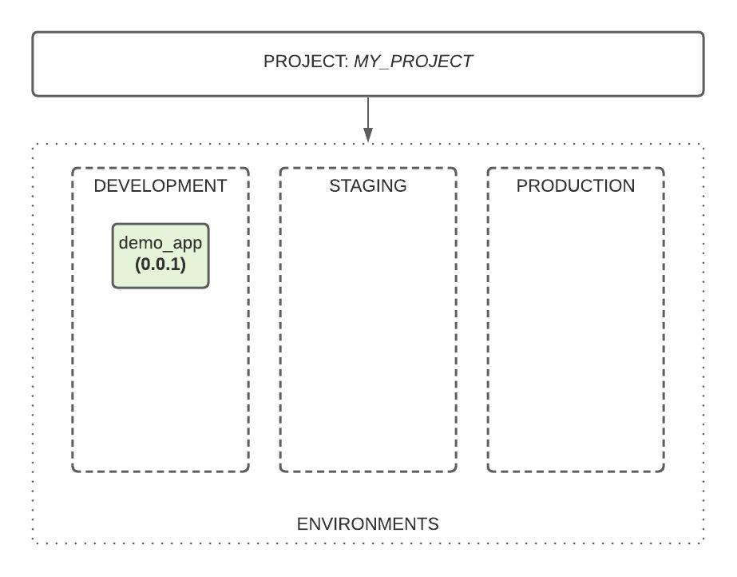
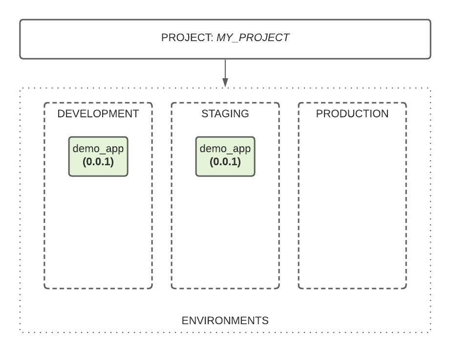

# Projects

## Overview

**Projects** are the essence of the code.store platform, which has the ability to contain many services. 

**Projects** serve as an isolated environment for services groups. Any project can contain one or more services, and available within the organization the user belongs to.

In order for the service to be publicly available, it must be included in the **project**, since the code.store platform guarantees high availability and scalability only in a **production** environment.  For more information about environments, see the [**Environments**](environments.md) section.

## Create a new project

In order to create a new project, you need to execute `cs project:create` command ****and provide information about your service. Below an example of `cs project:create` command execution:

```text
> cs project:create

 What is your project's name?
 Name: MY_PROJECT
 

 Please add a short description of your project. 255 chars max
 Description: This is my project.
 
 ? Is everything ok, can I create this project? (Y/n) Y
 
 ⠦ Creating Project "MY_PROJECT"   
```

Successful result of the command execution will be:

```text
✔ Your project "MY_PROJECT" with ID my_project has been created!
  › You can now add your services there using  codestore project:service:add  command.
    Use your developer key to access developer and stage environments: bb9c2512-3d4c-4e57-8dfa-99eafc1484c8 
```

After successful project creation, an access **key** to the **development** and **staging** environments will be issued in the command output. Information about authorization using the provided key can be found in [Access and Authorization](access-and-authorization.md) section.

When creating a new project, by default, the code.store platform will create three environments: **development**, **staging**, and **production.** For more information about environments, see the [**Environments**](environments.md) section. 

Let's make sure that the project has been created by running the `cs project:list` command.

```text
Project ID     Services     Author                   Description      
   
my_project     0            end-user@code.store      This is my project.                  
```

`Project ID` displays ids of all projects that available for user. Please, note, that ID is lowercase.  

`Services` count of included to project services.

`Author` email of the project creator.

`Description` description, which user set, when creating a project.

After creating a project, it will be available to all members of the organization to which the user belongs.

## Include service to project

By default, there are no services in the project. To add a new service to the project just execute `cs project:service:add` command with two arguments: **projectID** - where service should be included and **serviceID** - id of service, which will be included. 

For example, let's include service **demo\_app** to the **my\_project** project:

```text
> cs project:service:add my_project demo_app

 Would you like to enable billing for your service?
 Enable billing: No
✔ Service demo_app is included to project my_project
Status: DEPLOYMENT_INITIALIZING 

```


Will be included **version** of the service from the **demo** environment.


After command execution, the service is being to deploy to the **development** project environment.



To monitor service deployment status just execute `cs project:service:info` command and select the project and service.

```text
> cs project:service:info

 Choose which project you want to display information about
 Project: my_project


 Choose which service you want to display information about
 Service: demo_app

              Development                                                     
version       0.0.1                                                           
deployed      11/17/2020, 12:15:02 PM                                         
developer key                                                                 
url           https://api.code.store/8e7bf7e43f63414c9f7fc8d7fe7d0410/graphql 
```

`cs project:service:info` command output will display environments, where service is deployed \(in our case service just added to project and deployed only to **development** environment\), deployed service **version**, developer **key**, and the service **URL**. 

## Promote service 

After adding a new service to the project, it becomes necessary to deploy it not only to **development** but also to **staging** and **production** environments. 

To promote service per environments available  `cs project:service:promote` command. After command execution, you will be able to select the **project, service** which already included into the selected **project** and **environment**, where service should be deployed. 

```text
> cs project:service:promote

 Choose a project you want to promote to
 Project: my_project	This is my project.


 Choose a service which you want to promote
 Service: demo_app	demo

? Please select the environment staging


Updated "staging" in project my_project

```

In the example above, we promote service with ID: **demo\_app**, which already included to project with ID: **my\_project** to the **staging** environment.





YOU 



## Exclude service from project

## Delete project

