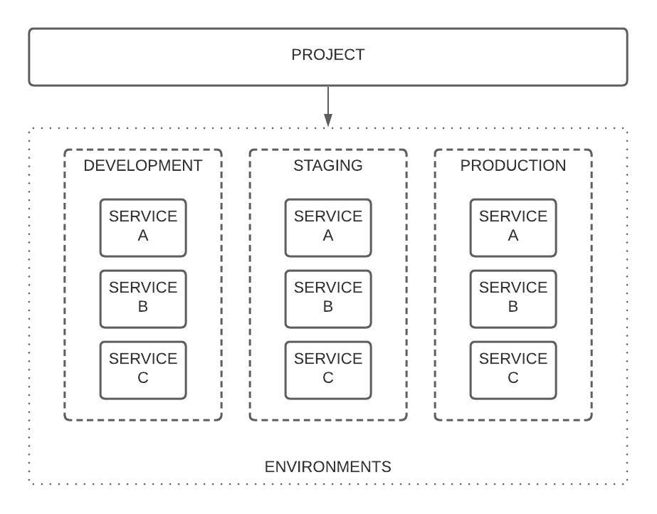
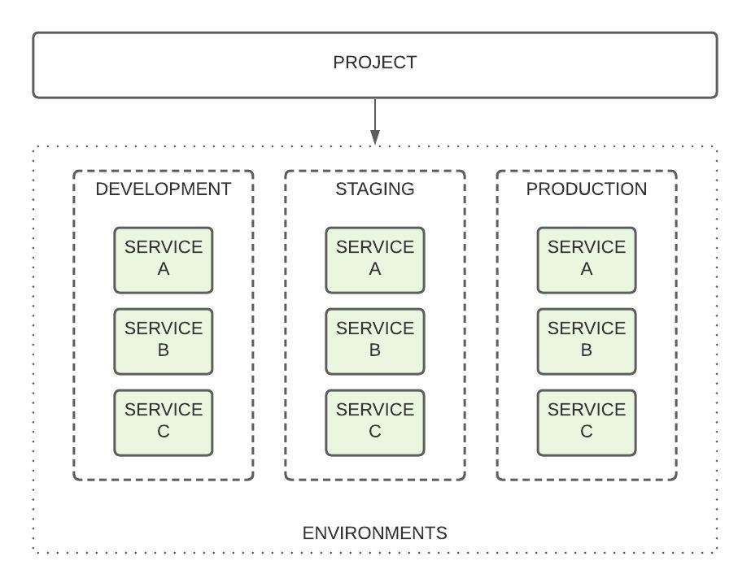
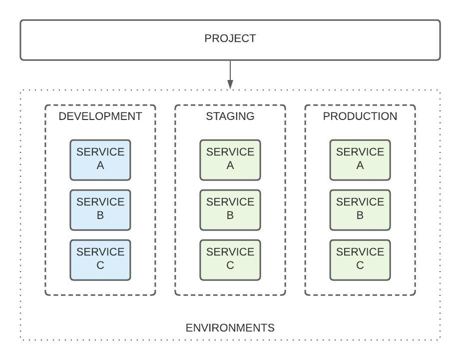
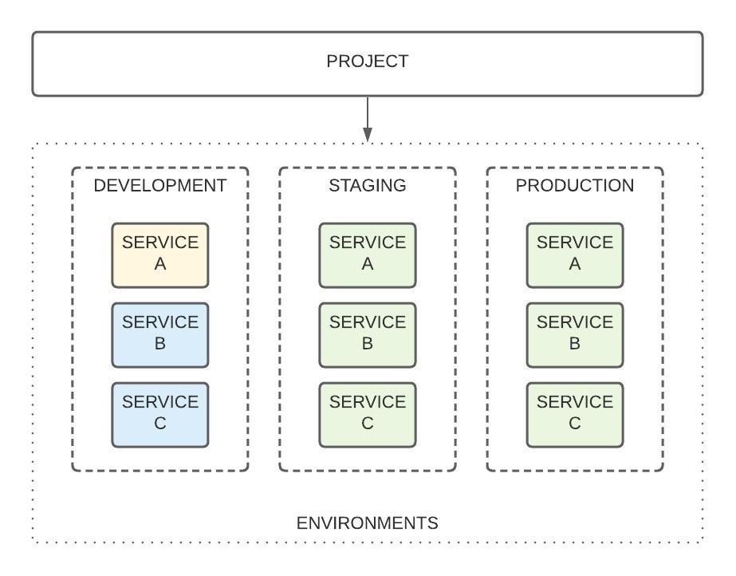

# Secret management

## Overview

Managing sensitive strings such as **passwords**, **API keys**, and **secret** **credentials**  — is just one of the steps in the quest for increasing security in a project. We understand this like no one else and provide an extremely easy and secure way of managing secret variables.

All secret variables are stored in [Vault](https://www.vaultproject.io/), secret storage from [HashiCorp](https://www.hashicorp.com/) organization, which provides a high-security level thanks to its architecture and secret engines.

## Service Secrets

For convenience, all variables that we specify for the service are available as environment variables. In order to add a new variable for the service, you can use the CLI interface, which can be found in [Commands section](../../cli/commands.md).


Please note, that each operation with a secret \(create, update, remove…\) will trigger **service** \(**container\) reboot**. Currently, we are working on improving the current secret delivery solution. Soon, secrets variables will deliver to your services on the fly.


Service secrets are secure key-value storage, which syntax is available using **cs secret** command. 

### Add a new service secret

To add a new secret variable just execute **cs secret:add** command with flags which next flags:

* `-k` key of the secret variable
* `-v` value of the secret variable
* `-s` service ID
* `-e` service environment

Information about all supported flags can be found on [Commands](../../cli/commands.md) section.

Below is an example of adding the **FOO** variable with the **BAR** value to the existing service with ID: **MY\_SERVICE**. For clarity, we will use a service that is deployed in a **demo** environment.

```text
cs secret:add -s MY_SERVICE -e demo -k FOO -v BAR
```

Successful result of the command execution will be:

```text
Successfully added a new secret variable FOO
Key Value Source                            
FOO BAR   Environment: demo, ServiceID: 1 
```

That’s it! Now, variable **FOO** will be available as an environment variable after container reboot. Now, you can access it in your code. 

For example, to access variable using TypeScript use `process`_:_ 

```text
process.env.FOO
```

### List service secrets

### Update service secret

### Remove service secret

## Project Service Secrets

Using the same command syntax we can add an environment variable for any project services. 

`-p` flag allows adding a variable on the project level.

```text
cs secret:add -p MY_PROJECT -s MY_SERVICE -e development -k FOO -v BAR
```

The **FOO** variable is now available inside the **MY\_SERVICE** service, which is included in the **MY\_PROJECT** project.

Please note**: MY\_SERVICE** service is already included in **MY\_PROJECT** project.

But what if my project includes many services that are deployed in different environments? Would be inconvenient to prescribe a separate set of secret variables for each service, so we implemented **inheritance**.

## Inheritance

There are cases when we need to specify only one secret variable for all services which includes in the whole project. In this case, we can just execute **`cs secret:add`** only with `-p` project flag.

Let's imagine that we have an empty project with ID: **MY\_PROJECT**, which includes three services with ID's: A, B, and C. They, by default, deployed on three project environments: development, staging, production. For more information about environments, see the [**Environments**](environments.md) section.



### Project level variables inheritance

Let’s add variable **FOO** with value **BAR** to project **MY\_PROJECT**, which will be available for each service on each environment inside **MY\_PROJECT** project.

```text
cs secret:add -p MY_PROJECT -k FOO -v BAR
```

Successful result of the command execution will be:

```text
Successfully added a new secret variable FOO
Key Value Source        
FOO BAR   ProjectID: 1 
```

As you can see, the **Source** of a variable - is a project, where we just added a new variable. From this moment, we can access **FOO** variable from each service, in each environment, which included in our project. In the diagram below, the services that have access to the value of the **FOO** variable are highlighted in green:



### Environments level variables inheritance

We may face a case when you need a **different** secret variable value on some service or on the whole environment. This isn't a problem, cause we can just override the value of the variable, using the same `cs secret:add` command, specifying for which environment/or service we should apply it.

For example, if we specify the **FOO** variable with value **BAR2** for a project **MY\_PROJECT** from the previous example and just set flag `-e` \(environment\) with value **development**, we override this value for each service in the development environment. 

```text
cs secret:add -p MY_PROJECT -e development -k FOO -v BAR2
```

Successful result of the command execution will be:

```text
Successfully added a new secret variable FOO
Key Value Source                                  
FOO BAR2  ProjectID: 1, Environment: development 
```

In this case, the **Source** displays the current variable source and shows that **FOO** variable has **BAR2** value for each service, WHICH includes in the project **MY\_PROJECT**, and deployed on the **development** environment. In the diagram below, the services that have access to the new value **BAR2** of ****the **FOO** variable are highlighted in blue:



### Service level variable inheritance

In case, when our service requires another secret variable value - we can just override it. To override it - just specify `-s` flag with service ID, let it be service **A** for example, and a new value of **FOO** variable is **BAR3**.

```text
cs secret:add -p MY_PROJECT -e development -s A -k FOO -v BAR3
```

Successful result of the command execution will be:

```text
Successfully added a new secret variable FOO
Key Value Source                                                 
FOO BAR3  ProjectID: 1, Environment: development, ServiceID: 1 
```

In this case, service A will obtain a new value of **FOO** variable. In the diagram below, the services that have access to the new value **BAR3** of ****the **FOO** variable are highlighted in yellow:




Basically, you can do the same with services, which deployed on demo and private environments. But note, that demo and private - is a non-production service environments, and has many limitations, including "per-request availability". To learn more see [**Environments**](environments.md) section.



