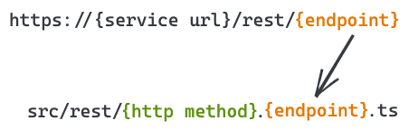

# REST

## Overview

At the moment, code.store's platform supports a simple file-system-based routing of REST API endpoints. 

REST endpoints are based on Express framework, so you can use all Express features to build your application.  Using REST-based on Express you are able to create endpoints of different methods \(such as GET, POST, PUT, DELETE, PATH…\), define your route paths, handlers, work with route parameters, define your middlewares… 

code.store platform simplifies the process of creating endpoints and their handlers using flexible configuration and provides an ability to generate a couple of entities.

## Endpoints

code.store platform exposes the **`http://{your service url}/rest/{endpoint}`** route, where **`{endpoint}`** is getting routed to the file **`./src/rest/{http method}.{endpoint}.ts`**. 



In order to create an endpoint, you need to create a new file in the `src/rest` folder \(by default, no such directory exists\) the name of which will contain the request method \(GET, POST, PUT, DELETE ...\) at the beginning of the name and the name of the route. For example:

* request GET **`http://localhost:3000/rest/helloWorld`** will be routed to **`src/rest/get.helloWorld.ts`**
* request POST **`http://localhost:3000/rest/user/create`** will get routed to **`src/rest/post.user.create.ts`**


Commands: **cs :generate:rest -m get -n helloWorld**  and  **cs :generate:rest -m get -n helloWorld** will avoid manual step of endpoint creation and generate files from previous example with predefined handlers. We strongly recommend using this way of endpoint creation. More information about endpoints generation can be found in [**Generation - REST**](../generation/rest.md) section. 


### Handlers

// TODO SECTION

code.store CLI also provides a way to generate templates for REST API endpoints with a command **`cs generate:rest --method {one of get, post, put, delete} --name {name of your endpoint}`**.  More information about endpoints generation can be found in [**Generation - REST**](../generation/rest.md) section.

By running **`cs generate:rest -m get -n helloWorld`** we will generate the following file at **`src/rest/get.helloWorld.ts`**:

```typescript
import { Handler } from 'codestore-utils';

const handler: Handler = async (event, context) => {
  // your code goes here
  return 'Hello, world!';
}

export default handler;
```

You can now run **`cs dev`** and send some test requests to your REST endpoint.


You can generate endpoints using **cs generate:rest** command


### Context

Handlers often need access to the request details. code.store platform provides access to the request and response objects of Express framework. 

Request object consist of:  
Response object consist of:

We can access the request and response objects just destructing context of your handler:

```text

```

Let's pass a few minutes on the arguments of the handler: _event_  is an object which contains the following properties:

```typescript
interface HandlerEvent {
    params: {
        query: {
            [key: string]: string;
        };
    };
    body: {
        [key: string]: string;
    };
    headers: {
        [key: string]: string;
    };
}
```

The next POST request **`curl -X POST 'http://localhost:3000/rest/helloWorld?hello=world' --data '{ "test": "object" }' -H "Content-Type: application/json"`** will result in the following _event_ object:

```javascript
{
  "params": {
    "query": {
      "hello": "world"
    }
  },
  "body": {
    "test": "object"
  },
  "headers": {
    "host": "localhost:3000",
    "user-agent": "curl/7.64.1",
    "accept": "*/*",
    "content-type": "application/json",
    "content-length": "20"
  }
}
```

The _context_ argument contains the database connection property which you can use with your TypeORM entities:

```typescript
context.db.connection.getRepository(...);
```

As you can see, the concept is very simple but is very powerful at the same time, as it allows you to create custom REST endpoints which could be used for integration with OAuth provides, Stripe or other payment systems which require callbacks!

## Middlewares

