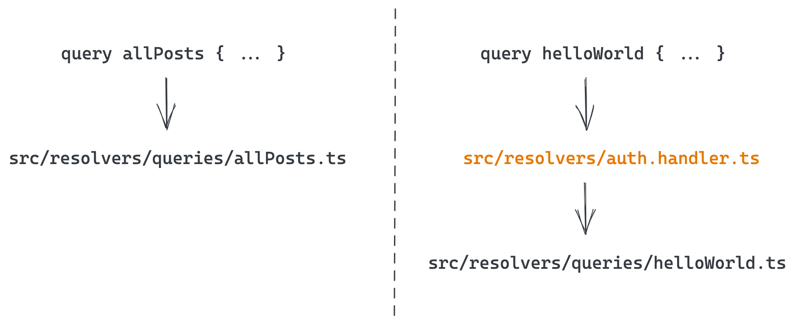
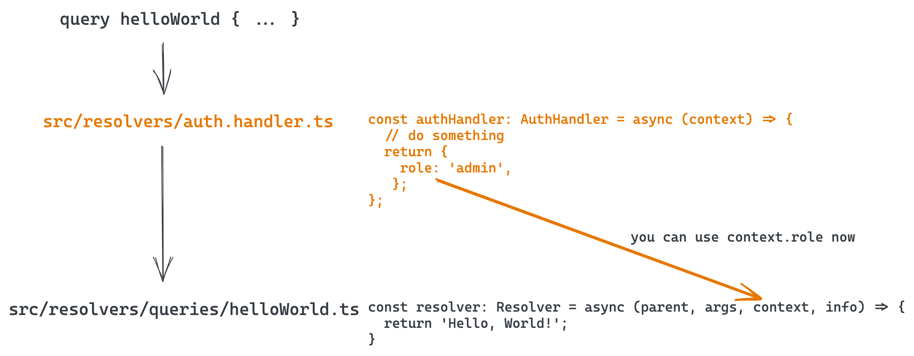

# Basic authentication

This guide covers writing custom middleware for authentication purposes.

### Overview

You can tell code.store to pass every request \(query or mutation\) marked with @auth directive via your custom middleware. In a nutshell, it looks like the following. Imagine, that you have two queries:

```graphql
# This directive has to be added to the top of your GraphQL schema
directive @auth on FIELD_DEFINITION

type Query {
    allPosts: [Post]
    helloWorld: String! @auth
}
```

Here is what happens on each request to one of those queries:



What happens is that all requests marked by @auth directive will pass via auth.handler.ts first and the context argument passed to the subsequent resolver is going to be concatenated with the return result of auth.handler:



That's not very complicated so let's build a simple example using this information!

### Very simple example

For the sake of simplicity, we are going to use the code from our [Quick Start guide](../quick-start/quick-start-with-cli.md) but essentially any other working service \(including the newly created one\) will suffice.

Let's take a look at our schema first:

```graphql
type Post {
    id: ID!
    createdAt: String!
    title: String!
    body: String!
    authorName: String!
}

type Query {
    allPosts: [Post]
    helloWorld: String!
}

type Mutation {
    createPost(title: String!, body: String!, authorName: String!): Post
}
```

As you may see, we have restored the helloWorld query, we also have restored the src/resolvers/queries/helloWorld.ts file too.

Let's modify our schema by adding the directive declaration and by marking one of the requests as @auth:

```graphql
directive @auth on FIELD_DEFINITION

type Post {
    id: ID!
    createdAt: String!
    title: String!
    body: String!
    authorName: String!
}

type Query {
    allPosts: [Post] @auth
    helloWorld: String!
}

type Mutation {
    createPost(title: String!, body: String!, authorName: String!): Post @auth
}

```

There are two things that happened here:

1. We added a declaration of the directive to the top of our schema.
2. We marked two of our requests \(query allPosts and mutation createPost\) with @auth directive, which means that we will be able to create and see the posts only as authenticated users. Neat!

At the moment, this @auth directive won't do anything, so let's add middleware and implement a very basic authentication model.

First, generate the handler file by running the following command in your service directory:

```bash
cs generate:handler -t auth
# this will generate src/resolvers/auth.handler.ts
```

This is what you will see inside the file \(I removed the comments to save screen-space\):

```typescript
// src/resolvers/auth.handler.ts

import { AuthHandler } from 'codestore-utils';

const authHandler: AuthHandler = async (context) => {
  // your code goes here
  return {};
};

export default authHandler;
```

The typical authentication flow is like the following:

* the client \(your front-end or another service\) will send a GraphQL request by passing some sort of authorization token in a specific header \(typically it would be 'Authorization' header\);
* your middleware will parse the token and validate it \(against another service, or by interrogating the database with active sessions, etc\);
* in the case when the token is not valid, your middleware will throw an error;
* otherwise, it will either do nothing or it will inject some information \(like the role of the user or an array of permissions, in the case of RBAC\) into the request context by returning an object with that information from the auth.handler.

Say no more, let's implement a very basic authorization, that is going to check the Authorization header and will compare it with two pre-defined tokens:


This is a very basic and insecure example of the authentication which is serving the demonstration purposes only and should not be used on production!


```typescript
import { logger, AuthHandler } from 'codestore-utils';

const authHandler: AuthHandler = async (context) => {
  // read the Authorization header from the request
  const authHeader = context.request.header('Authorization');
  logger.log(authHeader, 'auth.handler');

  // in this example we authorize and assign permissions based on two tokens
  // in reality these tokens should at least be encrypted
  if (authHeader === 'admin_token') {
    return {
      permissions: {
        read: true,
        write: true,
      }
    };
  } else if (authHeader === 'user_token') {
    return {
      permissions: {
        read: true,
        write: false,
      }
    };
  }
  
  // nope, we can't let you use this query/mutation without a token
  throw new Error('You shall not pass!');
};

export default authHandler;
```

I hope that it is really straightforward what we do in the above code: we react on two predefined tokens \(it's really hard to call them _tokens_, to be honest 😬\), based on which we will assign the permissions or in case if it's missing, we'll throw an error.

Next, we should somehow react to these permissions in our resolvers. Let's see how exactly we might do that:

```typescript
// src/resolvers/queries/allPosts.ts

import { logger, Resolver } from 'codestore-utils';
import Post from '../../data/entities/Post';

const resolver: Resolver = async (parent, args, context, info) => {
    // Here is how we check for permissions
    if (context?.permissions?.read !== true) {
        throw new Error('You do not have enough permission to read this article!');
    }
    
    logger.log('This is a allPosts resolver!', 'allPosts');
    const postRepository = context.db.connection.getRepository(Post);
    
    return postRepository.find();
}

export default resolver;
```

This is what has changed comparing to the code from our [Quick Start](../quick-start/quick-start-with-cli.md), we added a small **`if`** condition that checks the permissions in the request context argument:

```typescript
if (context?.permissions?.read !== true) {
    throw new Error('You do not have enough permission to read this article!');
}
```

Let's do the same for **`createPost.ts`** resolver:

```typescript
// src/resolvers/mutations/createPost.ts
import { logger, Resolver } from 'codestore-utils';
import Post from '../../data/entities/Post';

const resolver: Resolver = async (parent, args, context, info) => {
    // Checking permissions
    if (context?.permissions?.write !== true) {
        throw new Error('You do not have enough permission to create a Post!');
    }

    logger.log('creating a new Post', 'createPost');
    
    const post = new Post();
    post.title = args.title;
    post.authorName = args.authorName;
    post.body = args.body;
    post.createdAt = new Date().toISOString();

    logger.log(post, 'createPost');

    // Getting a database connection
    const repository = context.db.connection.getRepository(Post);
    
    // Saving our first post entity
    return await repository.save(post);
}

export default resolver;
```

That's it! We can now test how our changes impact the behaviour of the service.

### Testing

Let's test this baby! First of all, quick go-through to see what we are actually expecting:

1. query helloWorld should work as before, without any Authorization header \(or with it\);
2. query allPosts should return an error if the header is not specified;
3. query createPost should return an error if the header is not specified, or if the write permission does not equal true.

Let's test all these three scenarios.

#### 1. query helloWorld should work as before

```bash
$ curl 'http://localhost:3000/graphql' \
  -H "Content-Type: application/json" \
  --data '{ "query": "{ helloWorld }" }'
  
{"data":{"helloWorld":"Hello, World!"}}
```

OK, so that worked as expected. Moving next.


For the sake of better readability, I will be formatting the JSON output of my curl commands with jq '.' command. That's why the way how JSON output looks like in the examples below may be different from what you see on your screen.


#### 2. query allPosts

```bash
# This should normally fail
$ curl 'http://localhost:3000/graphql' \
  -H "Content-Type: application/json" \
  --data '{ "query": "{ allPosts { id title } }" }'                                                             12.18.3
  
{
  "errors": [
    {
      "message": "You shall not pass!",
      "locations": [
        {
          "line": 1,
          "column": 3
        }
      ],
      "path": [
        "allPosts"
      ],
      "extensions": {
        "code": "INTERNAL_SERVER_ERROR",
        "exception": {
          "stacktrace": [
            "Error: You shall not pass!",
            "..."
          ]
        }
      }
    }
  ],
  "data": {
    "allPosts": null
  }
}
```

You shall not pass indeed! Let's try to add the correct token header to our request:

```bash
$ curl 'http://localhost:3000/graphql' \
  -H "Authorization: user_token" \
  -H "Content-Type: application/json" \
  --data '{ "query": "{ allPosts { id title } }" }'

{
  "data": {
    "allPosts": [
      {
        "id": "1",
        "title": "Our First Article"
      },
      {
        "id": "2",
        "title": "Our Second Article"
      },
      {
        "id": "3",
        "title": "Our Third Article"
      }
    ]
  }
}
```

This time it worked as expected. Let's move on to the final part.

#### 3. mutation createPost

Let's try without the token first \(or with the user\_token, the result should be the same:

```bash
$ curl 'http://localhost:3000/graphql' \
    -H "Authorization: user_token" 
    -H "Content-Type: application/json" 
    --data '{ "query": "mutation createPost($title:String!, $body:String!, $authorName:String!) { createPost(title:$title, body:$body, authorName:$authorName) { id title body authorName } }", "variables": "{ \"title\": \"Our Fourth Article\", \"body\": \"Body\", \"authorName\": \"Arthur Conan Doyle\" }" }'
    
{
  "errors": [
    {
      "message": "You do not have enough permission to create a Post!",
      "locations": [
        {
          "line": 1,
          "column": 75
        }
      ],
      "path": [
        "createPost"
      ],
      "extensions": {
        "code": "INTERNAL_SERVER_ERROR",
        "exception": {
          "stacktrace": [
            "Error: You do not have enough permission to create a Post!"
          ]
        }
      }
    }
  ],
  "data": {
    "createPost": null
  }
}
```

Bang! 💣Let's add the correct token now:

```bash
$ curl 'http://localhost:3000/graphql' \
    -H "Authorization: admin_token" \
    -H "Content-Type: application/json" \
    --data '{ "query": "mutation createPost($title:String!, $body:String!, $authorName:String!) { createPost(title:$title, body:$body, authorName:$authorName) { id title body authorName } }", "variables": "{ \"title\": \"Our Fourth Article\", \"body\": \"Body\", \"authorName\": \"Arthur Conan Doyle\" }" }'
    
{
  "data": {
    "createPost": {
      "id": "4",
      "title": "Our Fourth Article",
      "body": "Body",
      "authorName": "Arthur Conan Doyle"
    }
  }
}
```

This time, it's a success.

### Conclusion

In this short tutorial, we wanted to show you how to put in place a basic authorization system in your service. The idea was to show the capabilities of our SDK on a simple example, but the same approach could be applied to authorization with external systems like AWS Cognito or Auth0, as well as with the dedicated service on code.store.

