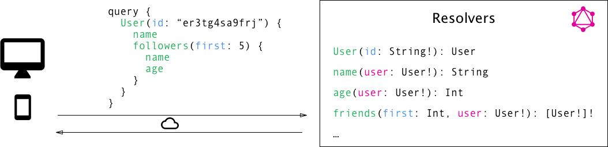

# GraphQL

When you create a service on **code.store**, it is accessible via a unique API endpoint and you'll need to use GraphQL in order to interact with this endpoint.

While you'll find all the details on [GraphQL site](https://graphql.org/), we've prepared you a short summary of GraphQL basics here.

### What is GraphQL ?

You can think of GraphQL as of SQL but for API \(it is a very loose and far-fetched analogy, but it should deliver the message\).

GraphQL is an API standard that provides a more efficient, powerful and flexible alternative to REST. It was developed and open-sourced by Facebook but now many companies, including us, support and rely on GraphQL. We do think it will become worldwide API standard very soon.

**code.store** GraphQL service is created by defining types and fields on those types, then providing resolvers for those types.

### GraphQL types

GraphQL has its own type system that’s used to define the schema of an API. The syntax for writing schemas is called [Schema Definition Language ](https://graphql.org/learn/schema/)\(SDL\).

Here is an example how we can use the SDL to define a simple type called `Product`:

```text
type Product { 
    title: String! 
    SKU: ID!
    descirption: String!
    price: Float!
    stock: Int!
    category: Category!
}
```

There are 5 built-in scalar types with GraphQL: `Int`, `Float`, `String`, `Boolean` and `ID`. Scalar types, as opposed to object types, point to actual data. The `ID` type resolves to a string, but expects a unique value.

#### Enumerations

Enumeration types allow to define a specific subset of possible values for a type. In the previous example, the `Category` enum type can take a value of `Clothes`, `Shoes` or `Watches` and anything else will result in a validation error.  We need to update our example providing definition of our enumeration category : 

```text
enum Category {
  Clothes
  Shoes
  Watches
}

type Product { 
    title: String! 
    SKU: ID!
    descirption: String!
    price: Float!
    stock: Int!
    category: Category!
}
```

#### Type modifiers

Modifiers can be used on the type that a field resolves to, by using characters like **`!`** and **`[…]`**. Here’s a breakdown, using the `String` scalar type as an example:

* `String`: nullable string \(the resolved value can be null\)
* `String!`: Non-nullable string \(if the resolved value is null, an error will be raised\) 
* `[String]`: Nullable list of nullable string values. The entire value can be null, or specific list elements can be null. 
* `[String!]`: Nullable list of non-nullable string values. Then entire value can be null, but specific list elements cannot be null. 
* `[String!]!`: Non-nullable list of non-nullable string values. Nothing can be null, neither the whole value nor the individual items. 

### GraphQL queries execution

GraphQL doesn’t just specify a way to describe schemas and a query language to retrieve data from those schemas, but an actual execution algorithm for how those queries are transformed into results. This algorithm is quite simple at its core: the query is traversed field by field, executing “resolvers” for each field.

The payload of a GraphQL query \(or mutation\) consists of a set of fields. In code.store, each of these fields actually corresponds to exactly one service that’s called a resolver. The sole purpose of a resolver function is to fetch the data for its field.

When **code.store** receives a query, it will call all the functions for the fields that are specified in the query’s payload. It thus resolves the query and is able to retrieve the correct data for each field. Once all resolvers returned, the server will package data up in the format that was described by the query and send it back to the client.



### Queries to retrieve data & mutations to push data

Queries as mutations are the methods or functions of your API. Both have arguments and can return scalars or objects. The difference between the two?

Use queries to query data **from** your API. With query, you do not modify your model \(even if you can, you should not\).

Use mutations to **update** or **create** things **in** your service model. Mutations are also methods or functions of your API and can accept arguments. Use them to modify your model.

A mutation can contain multiple fields, just like a query. There's one important distinction between queries and mutations, other than the name:

While query fields are executed in parallel, mutation fields run in series, one after the other.

This means that if we send two `incrementCredits` mutations in one request, the first is guaranteed to finish before the second begins, ensuring that we don't end up with a race condition with ourselves.

