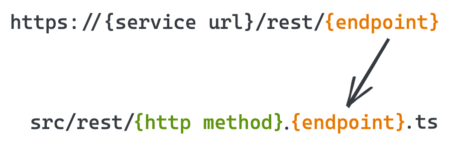

# REST APIs

At the moment, code.store's SDK supports a simple file-system-based routing of REST API endpoints. We are exposing the **`http://{your service url}/rest/{endpoint}`** route, where **`{endpoint}`** is getting routed to the file **`./src/rest/{http method}.{endpoint}.ts`**. 



For example:

* request GET **`http://localhost:3000/rest/helloWorld`** will be routed to **`src/rest/get.helloWorld.ts`**
* request POST **`http://localhost:3000/rest/user/create`** will get routed to **`src/rest/post.user.create.ts`**

code.store CLI also provides a way to generate templates for REST API endpoints with a command **`cs generate:rest --method {one of get, post, put, delete} --name {name of your endpoint}`**. 

By running **`cs generate:rest -m get -n helloWorld`** we will generate the following file at **`src/rest/get.helloWorld.ts`**:

```typescript
import { Handler } from 'codestore-utils';

const handler: Handler = async (event, context) => {
  // your code goes here
  return 'Hello, world!';
}

export default handler;
```

An _event_ argument is an object which contains the following properties:

```typescript
interface HandlerEvent {
    params: {
        query: {
            [key: string]: string;
        };
    };
    body: {
        [key: string]: string;
    };
    headers: {
        [key: string]: string;
    };
}
```

The _context_ argument contains the database connection property which you can use with your TypeORM entities:

```typescript
context.db.connection.getRepository(...);
```

You can now run **`cs dev`** and send some test requests to your REST endpoint.

As you can see, the concept is very simple but is very powerful at the same time, as it allows you to create custom REST endpoints which could be used for integration with OAuth provides, Stripe or other payment systems which require callbacks!

